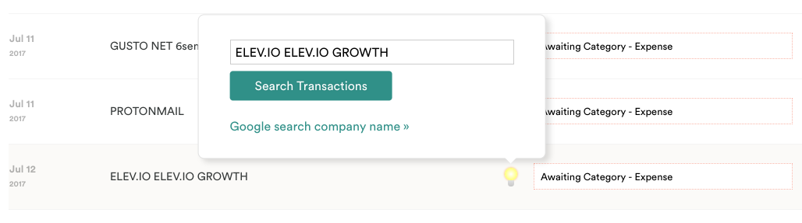
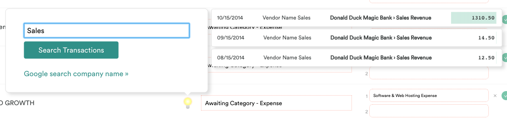
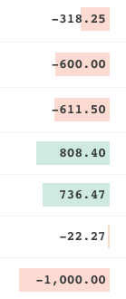
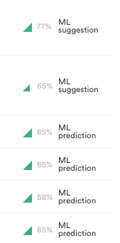

# Reconciliation UI Ideas

After observing a user interacting with the reconciliation UI, several opportunities were identified
for how to make common tasks easier to complete. This repo contains code that, when injected into
the reconciliation screen, adds features based on these observations.

## How to use it

The files in the `/static` folder need to be made available over HTTP. Then a bookmarklet can be
created that injects the code.

(1.) Run a local HTTP server and serve the `/static` folder:

```
http-server static
```

(2.) Create a new bookmark in your browser and set its URL to:

```
javascript:(()=>{var s = document.createElement('script');s.src='http://localhost:8080/inject.js';document.head.appendChild(s)})();
```

(3.) Navigate to a reconciliation and click the bookmarklet after the table has loaded.

## What changes?

### Insights modal

To the right of the vendor name in the "Company" column, a lightbulb icon appears when the row is
hovered. When it is clicked, a modal appears above the row.



This modal allows the user to perform a search on transactions by the same client. The query is
pre-populated with the vendor name and can be edited before performing a search. Search results
appear inline.



The link with the text "Google search company name »" will open a new tab with the Google search
results for the vendor name and switch to it. Clicks on this link can be tracked to get an idea of
which vendor strings are being searched. It is also possible to tie each tracked click of this
link to the specific transaction ID to get an idea of which ML suggestions are being double checked.

The modal can be closed by clicking anywhere outside of it on the page or by pressing
<kbd>esc</kbd>.

### Improved save/reset targets

The save and reset buttons are very small and close together, and there is no indication of the size
of the clickable area. This has been improved in several ways.


- The targets are made larger and are separated by whitespace
- The save button has an opaque background colour to aid the user in navigating their cursor to it
- The save button has a hover effect to indicate to the user when they have successfully navigated
  their cursor to it
- The reset button has a more dramatic hover effect with a danger colour to indicate to the user
  that it performs a destructive action

### Hide unused columns and give important data more whitespace

The "Document" and hidden actions columns are removed. This gives the amount, which is frequently
glanced at, more whitespace to aid in identifying it.

### Make amounts more intuitive to scan through

The amounts were in a proportional width font, a book weight, and left aligned. For these reasons it
was difficult to gauge the magnitude of the numbers. Users frequently need to make an estimation
about whether a transaction is "big" or "small" to know how to categorize it. Changes were made to
the way amounts are shown to make this estimation easier.



- A fixed width font is used and the text is right aligned so that the decimal places line up
- A bold font is used to aid legibility
- A background is applied that scales to the magnitude of the number and is either red or green for
  debits and credits respectively

### Confidence percentage

The ML predictions and suggestions did not show any information about the confidence of the guesses.
The icon was updated from simply showing that a ledger was chosen to exposing more information about
the prediction/suggestion.



- The percent confident in the chosen category is shown in a grey font for reference if needed
- A generalization of the percent confident is shown in the form of an icon that is larger for
  higher percents
